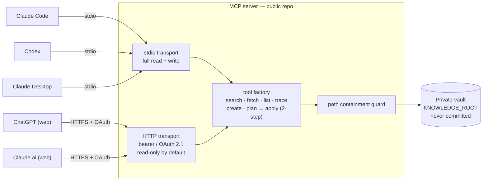

# Claude/OpenAI Markdown MCP Connector

[](https://github.com/theosera/claude_openai_mcp_connector/releases)
[](https://github.com/theosera/claude_openai_mcp_connector/actions/workflows/node.js.yml)
[](https://github.com/theosera/claude_openai_mcp_connector/actions/workflows/codeql.yml)

> **AIごとに同じ文脈を貼り直す作業をなくします。**
>
> このMCP connectorは、あなたのprivate Markdown / Obsidian vaultをGitHubに公開せず、Claude・ChatGPT互換クライアント・Codexから安全に検索できるようにします。

Local MCP server for exposing a private Markdown knowledge vault to MCP-capable clients such as Codex, Claude Desktop, Claude Code, and future ChatGPT/Claude remote connector deployments.

The code repository is intended to be public. The Obsidian Vault or other Markdown knowledge base stays private and is referenced only through `KNOWLEDGE_ROOT`.

## Architecture at a glance



Local clients connect over **stdio** (full tools); web clients connect over an
authenticated **HTTP** endpoint (read-only by default). Either way, every file
access is funnelled through the path-containment guard into the private vault —
which is never committed to this public repo.

## Features

- Search Markdown documents under a private local vault.
- Fetch document body, frontmatter, file stats, and source refs.
- List projects grouped by `client` and `project`.
- Create new Markdown documents.
- Edit existing Markdown through a two-step `plan_document_update` then `apply_planned_update` flow.
- Trace source refs, outgoing Markdown links, and backlink candidates.
- Reject path traversal, symlink escape, overwrite collisions, and stale patch application.

## Use cases

Concrete things you can do once your vault is connected. Your vault stays on your
machine and is **never published to GitHub or bulk-uploaded** — but note that over
the **web path** the specific notes you `fetch` are sent to that AI like any chat
message (read-only by default; see the privacy note in [`docs/PRFAQ.md`](./docs/PRFAQ.md)).

- **Stop re-pasting context.** Ask Claude or ChatGPT "what did I decide about
  *X*?" and it searches your own notes instead of you copy-pasting them into
  each chat.
- **Cross-note recall.** "Pull my earlier notes related to this topic" surfaces
  relevant Markdown across the whole vault (source refs + backlinks included).
- **Project-scoped lookup.** Group and retrieve documents by `client` /
  `project` frontmatter — e.g. "summarize everything under project *Acme*".
- **Cite your own knowledge.** ChatGPT-compatible `search` / `fetch` let a web
  connector use your vault as a first-class source with citations.
- **Safe edits from chat.** Have the AI draft an update, then approve it through
  the two-step `plan_document_update` → `apply_planned_update` flow (stale-safe,
  never silently overwriting).

## Which path should I use?

Pick by how technical you want to get. Most people should start with the green
path.

| Tier | You get | Effort | Best for |
| --- | --- | --- | --- |
| 🟢 **Local + Claude Desktop** | Vault in Claude Desktop, on your machine | copy-paste a small JSON config | non-engineers / first run |
| 🟡 **Local CLI** (Claude Code / Codex) | Vault in your terminal AI | one command / a TOML block | comfortable with a terminal |
| 🔴 **Web** (ChatGPT / Claude.ai) | Vault in the web apps | OAuth + HTTPS tunnel + a long-running host | technical; see [`docs/operations.md`](./docs/operations.md) |

The web path needs a server that stays up and a stable HTTPS URL — read
[`docs/operations.md`](./docs/operations.md) **before** relying on it.

## Before you start (prerequisites)

You need **Node.js 22.12+** (which includes `npm`). Check with `node -v`. If it's
missing, install it from <https://nodejs.org/> (LTS). This project uses
[`pnpm`](https://pnpm.io/) for builds — enable it once with:

```bash
corepack enable        # ships with Node; turns on pnpm
```

That's the whole toolchain. A one-command install that skips the build step is
on the [roadmap](./docs/ROADMAP.md).

## Setup

```bash
pnpm install
pnpm run build
```

Create a local `.env` file:

```bash
cp .env.example .env
```

Then set:

```text
KNOWLEDGE_ROOT=/path/to/private/obsidian-vault
MCP_WRITE_MODE=two_step
MCP_PATCH_STATE_DIR=.mcp-state/patches
```

Do not commit `.env`, private vault URLs, private vault paths, or real note content.

## Transports

The same server speaks two transports, selected with `MCP_TRANSPORT`:

| `MCP_TRANSPORT` | Use for | Tools |
| --- | --- | --- |
| `stdio` (default) | Local CLI / desktop clients: **Claude Code**, **Codex CLI**, **Claude Desktop** | full (read + write) |
| `http` | Remote **Chat connectors**: **ChatGPT**, **Claude.ai** | read-only by default; writes require `MCP_HTTP_ALLOW_WRITE=1` |

Chat connectors cannot launch a local process, so they require the HTTP
transport reachable over HTTPS. Authentication differs by client:

| Client | Transport | Auth it accepts |
| --- | --- | --- |
| Claude Code / Codex / Claude Desktop | stdio | none (local process) |
| Claude Desktop / Claude Code (remote), Claude **API** connector | HTTP | **static bearer** (`MCP_AUTH_TOKEN`) |
| **ChatGPT** (web, Developer mode), **Claude.ai** (web) | HTTP | **OAuth 2.1 only** — they cannot send a user-pasted bearer or custom header |

So the HTTP endpoint supports **both**: a static bearer (for Desktop/Code/API)
*and* a built-in OAuth 2.1 authorization server (for ChatGPT/Claude.ai web). It
binds to `127.0.0.1`; expose it to the internet only through an explicit HTTPS
tunnel.

### Run (stdio — local CLI clients)

```bash
pnpm run build
KNOWLEDGE_ROOT=/abs/path/to/vault node dist/index.js
```

### Run (HTTP — for ChatGPT / Claude.ai web, with OAuth)

Open the tunnel **first** so you know the public URL, then start the server with
that URL as the OAuth issuer:

```bash
# Terminal 1 — tunnel 127.0.0.1:8787 to a public HTTPS URL
cloudflared tunnel --url http://127.0.0.1:8787
# -> https://<random>.trycloudflare.com   (copy this)
```

```bash
# Terminal 2 — start the connector pointing at that public URL
pnpm run build
MCP_TRANSPORT=http \
MCP_HTTP_PORT=8787 \
MCP_HTTP_PUBLIC_URL="https://<random>.trycloudflare.com" \
MCP_OAUTH_ENABLED=1 \
MCP_OAUTH_PASSWORD="replace-with-a-strong-passphrase-you-choose" \
MCP_AUTH_TOKEN="$(openssl rand -hex 32)" \
KNOWLEDGE_ROOT=/abs/path/to/vault \
node dist/index.js
# Listening on http://127.0.0.1:8787/mcp (write=off, oauth=on)
```

Set `MCP_OAUTH_PASSWORD` to a strong passphrase **you choose** — you type it on
the OAuth consent screen when a web client connects. It must be non-empty (the
server refuses to start otherwise).

`MCP_HTTP_PUBLIC_URL` is the OAuth issuer and is auto-added to the
DNS-rebinding allowlist. The MCP endpoint to register is
`https://<random>.trycloudflare.com/mcp`. Tokens are **audience-bound** to that
`/mcp` resource and **scope-gated**: a connector only receives `vault.write`
when the server is started with `MCP_HTTP_ALLOW_WRITE=1` (otherwise it is
read-only regardless of what the client requests).

> Verify before registering: `GET /.well-known/oauth-protected-resource` returns
> JSON, and an unauthenticated `POST /mcp` returns `401` with a
> `WWW-Authenticate: Bearer resource_metadata="…"` header (this is what makes the
> web clients start the OAuth flow).

## Client registration

### Claude Code (CLI, stdio)

```bash
claude mcp add vault -- node /abs/path/to/claude_openai_mcp_connector/dist/index.js
# set KNOWLEDGE_ROOT in the spawned env, e.g. via a wrapper or:
claude mcp add vault --env KNOWLEDGE_ROOT=/abs/path/to/vault -- node /abs/.../dist/index.js
```

### Codex CLI (stdio)

```toml
# ~/.codex/config.toml
[mcp_servers.claude-openai-vault]
command = "node"
args = ["/abs/path/to/claude_openai_mcp_connector/dist/index.js"]
env = { KNOWLEDGE_ROOT = "/abs/path/to/private/vault" }
```

### Claude Desktop (stdio)

```jsonc
// claude_desktop_config.json
{
  "mcpServers": {
    "claude-openai-vault": {
      "command": "node",
      "args": ["/abs/path/to/claude_openai_mcp_connector/dist/index.js"],
      "env": { "KNOWLEDGE_ROOT": "/abs/path/to/private/vault" }
    }
  }
}
```

### ChatGPT (web, Developer mode — HTTP + OAuth)

1. Run the HTTP transport with OAuth + tunnel (above).
2. ChatGPT → **Settings → Connectors → Developer mode** (enable it).
3. **Create / Add custom connector** → MCP server URL =
   `https://<random>.trycloudflare.com/mcp`. Choose **OAuth** as the auth method.
4. ChatGPT auto-discovers the OAuth endpoints, dynamically registers itself, and
   opens the login page — enter your `MCP_OAUTH_PASSWORD` to authorize.
5. The connector then uses the issued token. The ChatGPT-compatible `search` /
   `fetch` tools are exposed alongside the native tools.

### Claude.ai (web, custom connector — HTTP + OAuth)

1. Claude.ai → **Settings → Connectors → Add custom connector**.
2. URL = `https://<random>.trycloudflare.com/mcp`.
3. Connect → Claude runs the OAuth flow → enter your `MCP_OAUTH_PASSWORD`.
4. Read-only unless the server was started with `MCP_HTTP_ALLOW_WRITE=1`.

> **Note on static bearer:** ChatGPT/Claude.ai **web** do not let you paste a
> bearer token or custom header — they require the OAuth flow above. The static
> `MCP_AUTH_TOKEN` bearer is for Claude Desktop / Claude Code (remote) and the
> Claude **API** MCP connector (`authorization_token`).

## Tools

- `search_documents`
- `fetch_document`
- `list_projects`
- `trace_sources`
- `create_document` *(write — stdio, or HTTP only with `MCP_HTTP_ALLOW_WRITE=1`)*
- `plan_document_update` *(write)*
- `apply_planned_update` *(write)*
- `search` / `fetch` — ChatGPT-connector-compatible read-only aliases

## Security

The vault is driven by an untrusted MCP client (an LLM), so security is enforced
in code and pinned by tests:

- **Path containment** — every file access is confined to `KNOWLEDGE_ROOT` by a
  multi-phase guard (length cap, control/NUL rejection, percent-decode
  validation, NFC normalization, absolute/`~`/`..` rejection, realpath prefix
  check, symlink-escape check). Violations fail closed (`src/pathSafety.ts`). The
  vault walk is also cycle-safe (tracks visited real paths) so a symlink loop
  can't cause unbounded recursion.
- **Frontmatter allowlist** — `plan_document_update` only accepts the
  `client` / `project` / `title` / `tags` / `source_refs` keys; `id` and
  `updated_at` are server-owned, and each value is type-checked (string vs
  string[]) — blocks YAML field injection and type confusion.
- **Stale-safe, non-destructive writes** — edits go through `plan` → `apply`
  with a SHA-256 staleness check; creates never overwrite (`flag: "wx"`).
- **Untrusted content boundary** — the server `instructions` declare returned
  content is data, never commands.
- **Authenticated, locked-down HTTP transport** — the remote endpoint requires a
  bearer token (`MCP_AUTH_TOKEN`, constant-time compare, fail-closed if unset),
  binds to `127.0.0.1` by default, enables DNS-rebinding protection
  (`allowedHosts`/`allowedOrigins`), caps request body size, and is **read-only
  unless explicitly opted into writes** — so exposing the vault to a Chat client
  never widens the local tool surface by accident.
- **OAuth 2.1 authorization server** (opt-in, for ChatGPT/Claude.ai web) — PKCE
  S256 mandatory, single-use short-TTL authorization codes bound to
  client/redirect/challenge, exact-match https/loopback redirect URIs (no open
  redirect), a slow-KDF (scrypt) login-password gate (fail-closed if unset),
  opaque 256-bit tokens with rotation, capped DCR inputs, and no secrets logged
  (`src/oauth/`). Tokens are **audience-bound** (RFC 8707) to the canonical
  `/mcp` resource and **scope-gated** (`vault.read` / `vault.write`): a
  read-scoped token's session never registers the write tools, so writes need
  both `MCP_HTTP_ALLOW_WRITE=1` *and* a `vault.write` token. The consent page
  sends `Content-Security-Policy: frame-ancestors 'none'`, `X-Frame-Options:
  DENY`, and `Referrer-Policy: no-referrer`.

Supply-chain & governance: GitHub Actions are SHA-pinned, workflows run with
`permissions: contents: read`, CODEOWNERS gates `.github/`, Dependabot + CodeQL
are enabled, and a 3-layer Claude Code agent governance model
(`CLAUDE.global.md` → `CLAUDE.md` → `.claude/skills/`) keeps the AI workflow
inside the same guardrails. See [`SECURITY.md`](./SECURITY.md) for the full
threat model and the curated mapping to the Reusable Security Baseline.

## Public Repo Safety

This repo intentionally ignores `vault/`, `knowledge/`, and `data/` to reduce the chance of committing private Markdown data. Tests use synthetic fixtures only.

## License

Released under the [MIT License](./LICENSE). Your private vault is **not** part
of this repository and is never published — only the connector code is licensed
here.
