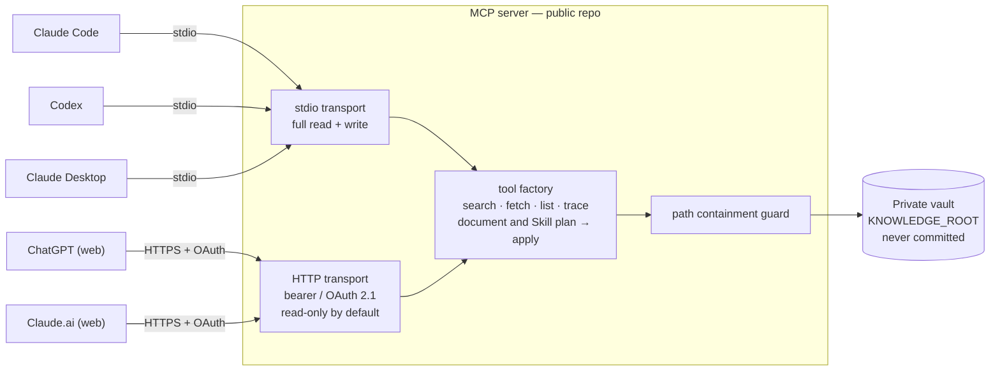

# Claude/OpenAI Markdown MCP Connector

[](https://github.com/theosera/claude_openai_mcp_connector/releases)
[](https://github.com/theosera/claude_openai_mcp_connector/actions/workflows/node.js.yml)
[](https://github.com/theosera/claude_openai_mcp_connector/actions/workflows/codeql.yml)

> **AIごとに同じ文脈を貼り直す作業をなくします。**
>
> このMCP connectorは、あなたのprivate Markdown / Obsidian vaultをGitHubに公開せず、Claude・ChatGPT互換クライアント・Codexから安全に検索できるようにします。

Local MCP server for exposing a private Markdown knowledge vault to MCP-capable clients such as Codex, Claude Desktop, Claude Code, and future ChatGPT/Claude remote connector deployments.

The code repository is intended to be public. The Obsidian Vault or other Markdown knowledge base stays private and is referenced only through `KNOWLEDGE_ROOT`.

## Architecture at a glance


```mermaid
flowchart LR
  CC["Claude Code"] -->|stdio| STDIO
  CX["Codex"] -->|stdio| STDIO
  CD["Claude Desktop"] -->|stdio| STDIO
  GPT["ChatGPT (web)"] -->|"HTTPS + OAuth"| HTTP
  CA["Claude.ai (web)"] -->|"HTTPS + OAuth"| HTTP

  subgraph Server["MCP server — public repo"]
    STDIO["stdio transport<br/>full read + write"]
    HTTP["HTTP transport<br/>bearer / OAuth 2.1<br/>read-only by default"]
    TOOLS["tool factory<br/>search · fetch · list · trace<br/>document and Skill plan → apply"]
    GUARD["path containment guard"]
  end

  STDIO --> TOOLS
  HTTP --> TOOLS
  TOOLS --> GUARD
  GUARD --> V[("Private vault<br/>KNOWLEDGE_ROOT<br/>never committed")]
```

Local clients connect over **stdio** (full tools); web clients connect over an
authenticated **HTTP** endpoint (read-only by default). Either way, every file
access is funnelled through the path-containment guard into the private vault —
which is never committed to this public repo.

## Features

- Search Markdown documents under a private local vault.
- Fetch document body, frontmatter, file stats, and source refs.
- List projects grouped by `client` and `project`.
- Create new Markdown documents either through the routed `projects/...`
  helper or at an exact vault-relative path through a path-confirmed two-step
  flow.
- Edit existing Markdown through a two-step `plan_document_update` then `apply_planned_update` flow.
- Create instruction-only Skill bundles through a separate two-step
  `plan_skill_create` then `apply_planned_skill_create` flow.
- Trace source refs, outgoing Markdown links, and backlink candidates.
- Reject path traversal, symlink escape, overwrite collisions, and stale patch application.

## Use cases

Concrete things you can do once your vault is connected. Your vault stays on your
machine and is **never published to GitHub or bulk-uploaded** — but note that over
the **web path** the specific notes you `fetch` are sent to that AI like any chat
message (read-only by default; see the privacy note in [`docs/PRFAQ.md`](./docs/PRFAQ.md)).

- **Stop re-pasting context.** Ask Claude or ChatGPT "what did I decide about
  _X_?" and it searches your own notes instead of you copy-pasting them into
  each chat.
- **Cross-note recall.** "Pull my earlier notes related to this topic" surfaces
  relevant Markdown across the whole vault (source refs + backlinks included).
- **Project-scoped lookup.** Group and retrieve documents by `client` /
  `project` frontmatter — e.g. "summarize everything under project _Acme_".
- **Cite your own knowledge.** ChatGPT-compatible `search` / `fetch` let a web
  connector use your vault as a first-class source with citations.
- **Safe edits from chat.** Have the AI draft an update, then approve it through
  the two-step `plan_document_update` → `apply_planned_update` flow (stale-safe,
  never silently overwriting).
- **Exact-path write-back.** Plan a complete new note at the intended
  vault-relative path, confirm that displayed path (or correct it in free text),
  then apply without overwriting anything already there.

## Which path should I use?

Pick by how technical you want to get. Most people should start with the green
path.

| Tier                                   | You get                                  | Effort                                     | Best for                                                    |
| -------------------------------------- | ---------------------------------------- | ------------------------------------------ | ----------------------------------------------------------- |
| 🟢 **Local + Claude Desktop**          | Vault in Claude Desktop, on your machine | copy-paste a small JSON config             | non-engineers / first run                                   |
| 🟡 **Local CLI** (Claude Code / Codex) | Vault in your terminal AI                | one command / a TOML block                 | comfortable with a terminal                                 |
| 🔴 **Web** (ChatGPT / Claude.ai)       | Vault in the web apps                    | OAuth + HTTPS tunnel + a long-running host | technical; see [`docs/operations.md`](./docs/operations.md) |

The web path needs a server that stays up and a stable HTTPS URL — read
[`docs/operations.md`](./docs/operations.md) **before** relying on it.

## Before you start (prerequisites)

You need **Node.js 22.12+** (which includes `npm`). Check with `node -v`. If it's
missing, install it from <https://nodejs.org/> (LTS). This project uses
[`pnpm`](https://pnpm.io/) for builds — enable it once with:

```bash
corepack enable        # ships with Node; turns on pnpm
```

That's the whole toolchain. A one-command install that skips the build step is
on the [roadmap](./docs/ROADMAP.md).

## Setup

```bash
pnpm install
pnpm run build
```

Create a local `.env` file:

```bash
cp .env.example .env
```

Then set:

```text
KNOWLEDGE_ROOT=/path/to/private/obsidian-vault
MCP_WRITE_MODE=two_step
# Optional. Defaults to ~/.mcp-state/patches-<hash of this vault's path>. The
# hash keeps servers started against different vaults from sharing one plan
# directory. Set this only to put plan state somewhere else, and use an absolute
# path — a relative one follows the caller's working directory, which a
# client-spawned stdio server does not control.
#MCP_PATCH_STATE_DIR=/abs/path/to/.mcp-state/patches
```

**Point the server at that file with `MCP_ENV_FILE` (absolute path).** The
connector reads an env file **only** from `MCP_ENV_FILE`; it does **not** read
`.env` from its working directory, because for a locally-spawned stdio server
that directory is chosen by the MCP client — an untrusted directory could
otherwise supply the bearer token, the transport, the bind address, and the
write opt-ins:

```bash
MCP_ENV_FILE=/abs/path/to/claude_openai_mcp_connector/.env node dist/index.js
```

Variables already present in the real environment always win over the file, and
a relative or unreadable `MCP_ENV_FILE` is a startup error rather than a silent
skip. Setting everything directly in the environment (systemd `Environment=`,
a launchd `EnvironmentVariables` dict, an MCP client's `env` block) works
exactly as before and needs no file at all.

Because the file supplies whatever the environment left unset — `MCP_TRANSPORT`
included — give each server its own: a file written for an HTTP endpoint makes
a stdio registration serve HTTP instead
([below](#the-env-file-the-stdio-registrations-name)).

To allow a remote client to create instruction-only Skills without exposing
general document writes, also set a vault-relative, pre-existing directory:

```text
MCP_SKILLS_SUBDIR=path/to/skills
MCP_HTTP_ALLOW_SKILL_WRITE=1
```

The directory must be **disjoint from `projects/`**, the root `create_document`
writes into — not `projects` itself, not a directory under it, and not `./`
(the whole vault). The Skills subtree is reserved against the general write
surface, so an overlap would make every document create fail; the server
refuses to start rather than let that surface silently stop working.

This surface is create-only: it accepts `SKILL.md`, optional flat
`references/*.md`, and optional `agents/openai.yaml`; it rejects scripts,
assets, arbitrary paths, and attempts to overwrite an existing Skill.

Do not commit `.env`, private vault URLs, private vault paths, or real note content.

### Multiple knowledge roots (optional)

To search **several repos at once** (e.g. your vault _plus_ a command-log repo),
set `KNOWLEDGE_ROOTS` instead of `KNOWLEDGE_ROOT`:

```text
KNOWLEDGE_ROOTS=vault=/path/to/private/obsidian-vault,ops=/path/to/ops-log-repo
```

- Comma-separated `name=path` pairs; names are lowercase alnum/dash/underscore.
- The **first** root is the primary and the only writable one
  (`create_document` / `plan_document_create` /
  `apply_planned_document_create` / `plan_document_update` /
  `apply_planned_update`); every other root is strictly **read-only** — writes
  addressed to it are rejected.
- Documents from non-primary roots are addressed as `name:relative/path` in
  search results, `fetch_document`, and `trace_sources`; results also carry a
  `root` field. With a single root, ids and paths are unchanged (fully
  backward compatible).
- Each root is served by its own path-containment guard chain; roots must be
  disjoint directories (nesting/duplicates are rejected at startup).

### Session archive hook (Claude Code history → vault)

This repo also ships a `session-archive` hook
(`.claude/skills/session-archive/`, wired in `.claude/settings.json`): on every
Stop/SessionEnd it renders the full Claude Code session transcript (title +
conversation + tool calls/results, secrets masked) into one Markdown note per
session inside your private vault clone and pushes it — so past sessions become
searchable through this MCP server. The vault clone is located via
`SESSION_VAULT_REPO` or a `.claude-session-vault` marker file at the vault
root; without either, the hook is a no-op. See
`.claude/skills/session-archive/SKILL.md`.

## Transports

The same server speaks two transports, selected with `MCP_TRANSPORT`:

| `MCP_TRANSPORT`   | Use for                                                                         | Tools                                                                                                                                      |
| ----------------- | ------------------------------------------------------------------------------- | ------------------------------------------------------------------------------------------------------------------------------------------ |
| `stdio` (default) | Local CLI / desktop clients: **Claude Code**, **Codex CLI**, **Claude Desktop** | full (read + write)                                                                                                                        |
| `http`            | Remote **Chat connectors**: **ChatGPT**, **Claude.ai**                          | read-only by default; document writes require `MCP_HTTP_ALLOW_WRITE=1`, constrained Skill creation requires `MCP_HTTP_ALLOW_SKILL_WRITE=1`, constrained audit writes require `MCP_HTTP_ALLOW_AUDIT_WRITE=1` (+ `MCP_AUDIT_SUBDIR`) |

**Both transports serve both MCP protocol eras** — the 2025 family and
2026-07-28 — from the same tool factory, so a client sees the same tools
whichever revision it negotiates. Their connection state differs: the HTTP
endpoint keeps **no session state** and re-derives the tool surface from the
presented token on every request, since successive requests can carry
different tokens; a stdio connection pins one instance, since its peer is the
process that spawned the server and cannot present a different one.

Chat connectors cannot launch a local process, so they require the HTTP
transport reachable over HTTPS. Authentication differs by client:

| Client                                                          | Transport | Auth it accepts                                                             |
| --------------------------------------------------------------- | --------- | --------------------------------------------------------------------------- |
| Claude Code / Codex / Claude Desktop                            | stdio     | none (local process)                                                        |
| Claude Desktop / Claude Code (remote), Claude **API** connector | HTTP      | **static bearer** (`MCP_AUTH_TOKEN`)                                        |
| **ChatGPT** (web, Developer mode), **Claude.ai** (web)          | HTTP      | **OAuth 2.1 only** — they cannot send a user-pasted bearer or custom header |

So the HTTP endpoint supports **both**: a static bearer (for Desktop/Code/API)
_and_ a built-in OAuth 2.1 authorization server (for ChatGPT/Claude.ai web). It
binds to `127.0.0.1`; expose it to the internet only through an explicit HTTPS
tunnel.

### Run (stdio — local CLI clients)

```bash
pnpm run build
KNOWLEDGE_ROOT=/abs/path/to/vault node dist/index.js
```

### Run (HTTP — for ChatGPT / Claude.ai web, with OAuth)

Open the tunnel **first** so you know the public URL, then start the server with
that URL as the OAuth issuer:

```bash
# Terminal 1 — tunnel 127.0.0.1:8787 to a public HTTPS URL
cloudflared tunnel --url http://127.0.0.1:8787
# -> https://<random>.trycloudflare.com   (copy this)
```

```bash
# Terminal 2 — start the connector pointing at that public URL
pnpm run build
MCP_TRANSPORT=http \
MCP_HTTP_PORT=8787 \
MCP_HTTP_PUBLIC_URL="https://<random>.trycloudflare.com" \
MCP_OAUTH_ENABLED=1 \
MCP_OAUTH_PASSWORD="replace-with-a-strong-passphrase-you-choose" \
MCP_AUTH_TOKEN="$(openssl rand -hex 32)" \
KNOWLEDGE_ROOT=/abs/path/to/vault \
node dist/index.js
# Listening on http://127.0.0.1:8787/mcp (write=off, oauth=on)
```

Set `MCP_OAUTH_PASSWORD` to a strong passphrase **you choose** — you type it on
the OAuth consent screen when a web client connects. It must be non-empty (the
server refuses to start otherwise).

`MCP_HTTP_PUBLIC_URL` is the OAuth issuer and is auto-added to the
DNS-rebinding allowlist (which is compared by hostname — the `:port` suffix in
`MCP_HTTP_ALLOWED_HOSTS` is optional and ignored). The MCP endpoint to register
is `https://<random>.trycloudflare.com/mcp`. Tokens are **audience-bound** to
that `/mcp` resource and **scope-gated**: a connector only receives
`vault.write` when at least one explicitly enabled write surface exists. The
server then registers only that surface, **on every request** — the endpoint
keeps no sessions on either protocol era, so the tool set always follows the
token actually presented. A token carrying no `vault.read` is refused with
`403 insufficient_scope` rather than served an empty tool list:
`MCP_HTTP_ALLOW_WRITE=1` enables document writes,
`MCP_HTTP_ALLOW_SKILL_WRITE=1` enables constrained Skill creation, and
`MCP_HTTP_ALLOW_AUDIT_WRITE=1` (with `MCP_AUDIT_SUBDIR`) enables only the
constrained audit tools — set it **without** `MCP_HTTP_ALLOW_WRITE` to run a
read-only-plus-audit "scan" endpoint whose write reach is one reserved subtree.

By default OAuth state (registered clients and tokens) lives in process memory,
so every server restart forces web clients to re-authorize. Set
`MCP_OAUTH_STATE_FILE=/abs/path/to/oauth-state.json` to persist that state —
registered clients and token records — across restarts. (Not to be confused with
the MCP protocol sessions removed above: those are gone entirely, this is the
OAuth authorization a web client already completed.) Tokens are stored
**as sha256 hashes** (the file contains nothing
recoverable), it is written `0600` with an integrity MAC keyed from
`MCP_OAUTH_PASSWORD`, and any tampering — or a rotated password — fails closed
by discarding the state (everyone simply re-authorizes).

> Verify before registering: `GET /.well-known/oauth-protected-resource` returns
> JSON, and an unauthenticated `POST /mcp` returns `401` with a
> `WWW-Authenticate: Bearer resource_metadata="…"` header (this is what makes the
> web clients start the OAuth flow).

## Client registration

> **Every setting a stdio server needs must be in the `env` block below or in
> the file named by `MCP_ENV_FILE`** — the server does not read a `.env` from
> the directory the client happens to spawn it in. A stdio server is always
> write-capable, so if you use the reserved subtrees, carry
> **`MCP_AUDIT_SUBDIR`** (and `MCP_SKILLS_SUBDIR`) here too: they are optional,
> so omitting `MCP_AUDIT_SUBDIR` does **not** fail startup — it just starts with
> the INV-9 audit-subtree reservation **off**. The startup line on stderr
> (`… audit=off`) is how you see that; see
> [`operations.md` §9](./docs/operations.md#9-two-endpoint-deployment-interactive--unattended-audit-scan).
>
> **Every example below therefore carries `MCP_ENV_FILE`**, and none of them can
> be copied into a working registration without it. Leave it out only if this
> vault uses neither reserved subtree — and then confirm that choice against the
> startup line rather than assuming it.

### The env file the stdio registrations name

Give the stdio servers **their own** file — one that says nothing about a
transport, a port, or a credential. Keep it outside the vault (anything under
`KNOWLEDGE_ROOT` is vault content), mode `600`:

```text
# /abs/path/.mcp-state/vault-stdio.env  — stdio registrations only
MCP_SKILLS_SUBDIR=_skills             # same subtree as the HTTP endpoints
MCP_AUDIT_SUBDIR=90_Audit/vault-scan  # same subtree — reserves it here (INV-9)

# Deliberately absent:
#   MCP_TRANSPORT      — the default is stdio; see the warning below
#   MCP_AUTH_TOKEN, MCP_OAUTH_*, MCP_HTTP_*  — HTTP-only, nothing reads them here
#   MCP_PATCH_STATE_DIR — unset gives this process its own per-root default
#                         (~/.mcp-state/patches-<hash>), which is what you want
```

> **Do not point a stdio registration at an HTTP endpoint's env file.** The
> file fills in whatever the real environment left unset, so an `MCP_TRANSPORT=http`
> line inside it wins: the process **starts an HTTP listener and never speaks
> stdio**. It does not fail — the client just sees a server that never answers,
> and the listener collides with the real endpoint's port. Observed, running the
> registration command against `…/claude_openai_mcp_connector/.env` from
> [`operations.md` §9 Step 2](./docs/operations.md#step-2--two-env-files-each-named-by-mcp_env_file):
>
> ```text
> stderr: MCP HTTP transport listening on http://127.0.0.1:8799/mcp (write=off, …)
> stdout: (empty)
> exit:   never — killed at the timeout
> ```
>
> The interactive and scan files also carry `MCP_AUTH_TOKEN` / `MCP_OAUTH_PASSWORD`,
> which a local stdio process has no use for. Three endpoints, three files.

### Claude Code (CLI, stdio)

```bash
# Roots in the registration, everything else in the stdio env file above.
# MCP_ENV_FILE is what carries MCP_AUDIT_SUBDIR / MCP_SKILLS_SUBDIR into this
# always-write-capable process; a registration without it starts normally with
# the INV-9 reservation off.
claude mcp add vault \
  --env KNOWLEDGE_ROOT=/abs/path/to/private/vault \
  --env MCP_ENV_FILE=/abs/path/.mcp-state/vault-stdio.env \
  -- node /abs/path/to/claude_openai_mcp_connector/dist/index.js
```

`KNOWLEDGE_ROOT` may appear in both places without conflict: the real
environment wins and the file only fills what the environment left unset.

### Codex CLI (stdio)

```toml
# ~/.codex/config.toml
[mcp_servers.claude-openai-vault]
command = "node"
args = ["/abs/path/to/claude_openai_mcp_connector/dist/index.js"]

[mcp_servers.claude-openai-vault.env]
KNOWLEDGE_ROOT = "/abs/path/to/private/vault"
MCP_ENV_FILE = "/abs/path/.mcp-state/vault-stdio.env"
```

### Claude Desktop (stdio)

```jsonc
// claude_desktop_config.json
{
  "mcpServers": {
    "claude-openai-vault": {
      "command": "node",
      "args": ["/abs/path/to/claude_openai_mcp_connector/dist/index.js"],
      "env": {
        "KNOWLEDGE_ROOT": "/abs/path/to/private/vault",
        "MCP_ENV_FILE": "/abs/path/.mcp-state/vault-stdio.env"
      }
    }
  }
}
```

### Verify a stdio registration

The reservation being off is silent by design (`MCP_AUDIT_SUBDIR` is optional,
so its absence is not a startup error). Run the **same command and env the
registration uses**, with stdin closed, and read the one line it writes to
stderr:

```bash
MCP_ENV_FILE=/abs/path/.mcp-state/vault-stdio.env \
KNOWLEDGE_ROOT=/abs/path/to/private/vault \
  node /abs/path/to/claude_openai_mcp_connector/dist/index.js </dev/null 2>&1 >/dev/null | head -1
```

```text
MCP stdio transport ready (write=on, documents=on, legacy_create=off, skills=on, audit=reserved-only)
```

`legacy_create=off` is also the expected value. It means the one-step
`create_document` is **not** registered: every document write this process offers
goes plan → your approval → apply, so nothing reaches the vault between a tool
call and a diff you have seen. Set `MCP_ALLOW_LEGACY_CREATE_DOCUMENT=1` only if
you still depend on the old routed-capture route.

`skills` and `audit` each have three states, and **`reserved-only` is the
expected one** for the env file above — it is the recommended configuration, not
a half-finished one:

| value | meaning |
| --- | --- |
| `reserved-only` | The subdir setting reached the process, so the subtree reservation is in effect (INV-8 for Skills, INV-9 for audit), and that surface's **write tools are not registered**. This is what you want for an interactive session. |
| `on` | the same, **plus** the write tools registered, because that transport's own opt-in is set — `MCP_STDIO_ALLOW_SKILL_WRITE` / `MCP_STDIO_ALLOW_AUDIT_WRITE`. Intended for a process whose job is to write there, not for a session you type into. |
| `off` | no subdir setting — on a write-capable process this means general writes can still reach that subtree, i.e. the registration is not finished. |

Do **not** set either flag just to make the line read `on`. Reserving a subtree
and holding the tools that write into it are separate decisions, which is why
one word could never describe both.

The audit tools are single-call writes into the audit trail with no plan/apply
step and no confirmation. Skill creation _is_ two-step, so it is not that same
exposure — but a Skill is loaded by later sessions **as instructions**, which is
the premise the whole constrained Skill surface exists for. An interactive
session, whose input includes untrusted vault content, is who should hold
neither.

A line beginning `MCP HTTP transport listening`,
or no line at all before the command hangs, means the env file belongs to an
HTTP endpoint (warning above). This works for any client because it bypasses the
client entirely; nothing here depends on where that client keeps its logs.

### ChatGPT (web, Developer mode — HTTP + OAuth)

1. Run the HTTP transport with OAuth + tunnel (above).
2. ChatGPT → **Settings → Connectors → Developer mode** (enable it).
3. **Create / Add custom connector** → MCP server URL =
   `https://<random>.trycloudflare.com/mcp`. Choose **OAuth** as the auth method.
4. ChatGPT auto-discovers the OAuth endpoints, dynamically registers itself, and
   opens the login page — enter your `MCP_OAUTH_PASSWORD` to authorize.
5. The connector then uses the issued token. The ChatGPT-compatible `search` /
   `fetch` tools are exposed alongside the native tools.

### Claude.ai (web, custom connector — HTTP + OAuth)

1. Claude.ai → **Settings → Connectors → Add custom connector**.
2. URL = `https://<random>.trycloudflare.com/mcp`.
3. Connect → Claude runs the OAuth flow → enter your `MCP_OAUTH_PASSWORD`.
4. Read-only unless a write surface was explicitly enabled; document writes and
   constrained Skill creation have separate flags.

> **Note on static bearer:** ChatGPT/Claude.ai **web** do not let you paste a
> bearer token or custom header — they require the OAuth flow above. The static
> `MCP_AUTH_TOKEN` bearer is for Claude Desktop / Claude Code (remote) and the
> Claude **API** MCP connector (`authorization_token`).

## Tools

- `search_documents` —
  `{ query, client?, project?, tags?, limit?, offset?, path_prefix?, root?, updated_after?, updated_before?, order?, recency_weight?, explain? }`
  → `{ results, total_count, offset, limit }`. `total_count` is the match count
  **before** `limit`, so a client can tell "10 hits" from "10 of 400" without
  re-querying. Queries and note text are folded with NFKC, so half-width /
  full-width and decomposed / composed forms match each other, and a query in a
  script without spaces (Japanese, say) is segmented into words — `検索エンジン設計`
  finds a note that says `検索エンジンの設計`. `order` is `relevance` (default with a
  query), `recent`, or `path` (default without one). `explain` adds a per-signal
  `score_breakdown` to each result. Recency ranking is **off unless configured**
  — see `MCP_SEARCH_RECENCY_WEIGHT` in `.env.example`.
- `fetch_document`
- `list_projects`
- `trace_sources` — source refs, outgoing links and backlinks, plus a
  `resolved_outgoing[]` saying what each link landed on. Links resolve on **path
  facts only**: an exact vault-relative path, then the link text as a filename.
  Relative Markdown links are resolved against the linking note's own directory.
  A note's frontmatter `title` / `aliases` are self-declared, so they never
  resolve a link — not even a unique one — and show up as `candidates[]` on an
  unresolved link instead. Optional `depth` (1–2) and `direction`
  (`out` / `in` / `both`) add a bounded `related[]` neighbourhood; `backlinks`
  stays complete and is unaffected by `direction`.
- `get_context` — one call instead of a search → fetch loop. Seeds from a search
  over the same filters, expands one or two hops through the link graph, drops
  duplicates, splits long notes at their headings, and packs greedily to a
  `token_budget` (500–32000, default 4000). Every chunk carries its provenance
  (`relationship`, `path`, `heading_path`, `score`) and **what did not fit is
  reported in `omitted[]` with a reason** — one entry per document per reason,
  capped, with `omitted_count` giving the true total — so a short answer is
  distinguishable from a complete one, and a shortened list from the whole story. Needs at least one of `query`, `project`,
  `tags` or `path_prefix` — there is deliberately no way to ask for the whole
  vault. No single document may take more than 40% of the budget, so one large
  note cannot become the entire answer; a chunk cut to fit says `truncated`.
  Optional owner-controlled type weighting via `MCP_CONTEXT_TYPE_RULES` (below).
  Read-only, and available on every transport.
- `create_document` _(write, **off by default on every transport** — needs write to be enabled **and** `MCP_ALLOW_LEGACY_CREATE_DOCUMENT=1`; the one-step legacy route, superseded by `plan_document_create` → `apply_planned_document_create`)_
- `plan_document_create` _(write; exact path, complete-file diff, no target mutation)_
- `apply_planned_document_create` _(write; exact confirmed path required, create-only)_
- `plan_document_update` _(write)_
- `apply_planned_update` _(write)_
- `plan_skill_create` _(Skill write — needs `MCP_SKILLS_SUBDIR` **and** the transport's own opt-in: `MCP_HTTP_ALLOW_SKILL_WRITE` on HTTP, `MCP_STDIO_ALLOW_SKILL_WRITE` on stdio)_
- `apply_planned_skill_create` _(Skill write; create-only, atomic, never overwrites)_
- `append_audit_report` _(audit write — needs `MCP_AUDIT_SUBDIR` **and** the transport's own opt-in: `MCP_HTTP_ALLOW_AUDIT_WRITE` on HTTP, `MCP_STDIO_ALLOW_AUDIT_WRITE` on stdio; create-only reports in the reserved subtree, never overwrites)_
- `compare_and_swap_audit_state` _(audit write; atomic sha256 compare-and-swap of the reserved `state.md`)_
- `search` / `fetch` — ChatGPT-connector-compatible read-only aliases

### Document-type weighting for `get_context` (optional)

`MCP_CONTEXT_TYPE_RULES=/absolute/path/rules.json` lets the vault's owner tell
the packer which parts of the vault are worth more. Unset, every document weighs
the same and ranking is byte-identical to not having the feature.

```jsonc
{
  "rules": [
    { "name": "permanent", "match": { "path_prefix": "permanent/" }, "weight": 1.5 },
    { "name": "agent-log",  "match": { "root": "ops" },              "weight": 0.6 },
    { "name": "inbox",      "match": { "path_prefix": "inbox/" },    "weight": 0.3 },
    { "name": "tagged",     "match": { "tag": "synthesis" },         "weight": 1.2 }
  ],
  "frontmatter_type_hint": { "enabled": false, "max_weight": 1.25 }
}
```

First rule that matches wins, so order is the priority statement. Two limits are
enforced rather than documented:

- **The file must live outside every knowledge root, or the server refuses to
  start.** A root is synced and writable — by Obsidian peers, by imported notes,
  by the MCP write tools — so a rules file inside one would let anything that can
  write a note decide what the packer trusts.
- **A weight above 1.25 can only come from a signal the owner controls** — a
  `root` name (configuration) or a `path_prefix` (the filesystem). `tag` and the
  frontmatter `type` hint are things a note says about itself, so they are
  clamped to 1.25 and cannot outrank a directory you chose. `type` is
  deliberately **not** in the frontmatter patch allowlist either, so promoting a
  document stays an edit you make in Obsidian.

## Security

The vault is driven by an untrusted MCP client (an LLM), so security is enforced
in code and pinned by tests:

- **Path containment** — every file access is confined to `KNOWLEDGE_ROOT` by a
  multi-phase guard (length cap, control/NUL rejection, percent-decode
  validation, NFC normalization, absolute/`~`/`..` rejection, realpath prefix
  check, symlink-escape check). Violations fail closed (`src/pathSafety.ts`). The
  vault walk is also cycle-safe (tracks visited real paths) so a symlink loop
  can't cause unbounded recursion.
- **Frontmatter allowlist** — `plan_document_update` only accepts the
  `client` / `project` / `title` / `tags` / `source_refs` keys; `id` and
  `updated_at` are server-owned, and each value is type-checked (string vs
  string[]) — blocks YAML field injection and type confusion.
- **Stale-safe, non-destructive writes** — edits go through `plan` → `apply`
  with a SHA-256 staleness check. Exact-path creates also go through `plan` →
  target-path confirmation → `apply`; staged content is hash-checked and every
  create uses `flag: "wx"`, so it never overwrites.
- **Constrained Skill creation** — a separate vault-relative root, exact
  `SKILL.md` frontmatter, fixed file allowlist and size caps, plan/apply approval,
  and same-filesystem atomic directory creation; existing Skills are immutable.
- **Untrusted content boundary** — the server `instructions` declare returned
  content is data, never commands.
- **Authenticated, locked-down HTTP transport** — the remote endpoint requires a
  bearer token (`MCP_AUTH_TOKEN`, constant-time compare, fail-closed if unset),
  binds to `127.0.0.1` by default, enables DNS-rebinding protection
  (`allowedHosts`/`allowedOrigins`), caps request body size, and is **read-only
  unless explicitly opted into writes** — so exposing the vault to a Chat client
  never widens the local tool surface by accident.
- **OAuth 2.1 authorization server** (opt-in, for ChatGPT/Claude.ai web) — PKCE
  S256 mandatory, single-use short-TTL authorization codes bound to
  client/redirect/challenge, exact-match https/loopback redirect URIs (no open
  redirect), a slow-KDF (scrypt) login-password gate (fail-closed if unset),
  opaque 256-bit tokens with rotation, capped DCR inputs, and no secrets logged
  (`src/oauth/`). Tokens are **audience-bound** (RFC 8707) to the canonical
  `/mcp` resource and **scope-gated** (`vault.read` / `vault.write`): a
  read-scoped token's session never registers write tools. A write needs the
  matching server-side flag and a `vault.write` token; document and constrained
  Skill surfaces are gated independently. The consent page
  sends `Content-Security-Policy: frame-ancestors 'none'`, `X-Frame-Options:
DENY`, and `Referrer-Policy: no-referrer`.

Supply-chain & governance: GitHub Actions are SHA-pinned, workflows run with
`permissions: contents: read`, CODEOWNERS gates `.github/`, Dependabot + CodeQL
are enabled, and a 3-layer Claude Code agent governance model
(`CLAUDE.global.md` → `CLAUDE.md` → `.claude/skills/`) keeps the AI workflow
inside the same guardrails. See [`SECURITY.md`](./SECURITY.md) for the full
threat model and the curated mapping to the Reusable Security Baseline.

## Public Repo Safety

This repo intentionally ignores `vault/`, `knowledge/`, and `data/` to reduce the chance of committing private Markdown data. Tests use synthetic fixtures only.

## License

Released under the [MIT License](./LICENSE). Your private vault is **not** part
of this repository and is never published — only the connector code is licensed
here.
